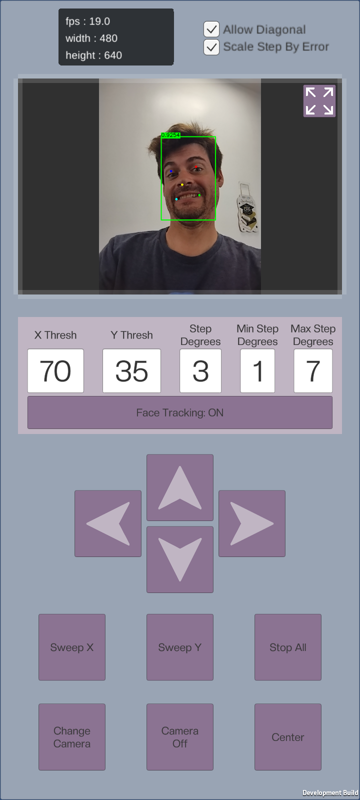

# 3D Printed Pan-Tilt Rig

You can download the 3D model for the pan-tilt camera rig here:

[Download 3D Model on Thingiverse](https://www.thingiverse.com/thing:7233469)

# Pan-Tilt Face Tracking App

This app lets you control a pan-tilt camera rig using face tracking, directly from your Android device. No Unity experience required—just install the APK and start using the features!

## Features

- **Live Face Tracking:** Automatically detects and tracks faces in real time.
- **FPS & Resolution Display:** Shows current frame rate and camera resolution.
- **Camera Controls:**
	- Change camera (front/rear)
	- Turn camera feed on/off
	- Fullscreen/regular view toggle
- **Face Tracking Controls:**
	- Enable/disable face tracking
	- X/Y threshold adjustment
	- Step size and min/max step degrees
	- Scale step by error and allow diagonal movement
- **Manual Pan-Tilt Controls:**
	- Arrow buttons for direct movement
	- Sweep X/Y for automated scanning
	- Center and Stop All buttons
- **Status Display:**
	- Face tracking status (ON/OFF)

## ESP32 Setup

To use the pan-tilt hardware, you must install the ESP32 control files (firmware) from this GitHub repository onto your ESP32 device. Use ArduinoIDE or a similar process to upload the firmware. See the ESP32 Files folder in the repo for details.

## How to Use

1. **Install the APK** on your Android device.
2. **Connect your pan-tilt hardware via USB.**
	- **Note:** BLE (Bluetooth Low Energy) channel is not active yet, but will be available soon. For now, use USB connection for hardware control.
3. **Launch the app.**
4. The camera feed will appear at the top, with face tracking enabled by default.
5. Use the on-screen controls to:
	- Adjust tracking sensitivity and movement
	- Manually control the pan-tilt rig
	- Toggle camera and display modes
	- Change camera source (front/rear)
6. For fullscreen camera view, tap the expand button in the top right corner.
7. To restore regular size, tap the restore button.
8. All controls are touch-friendly and designed for quick access.

## Reference UI

The screenshot below shows all available controls and features:

## Support

For troubleshooting or hardware setup, see the included documentation

---
MIT License. ESP32 firmware and third-party assets subject to their own licenses.